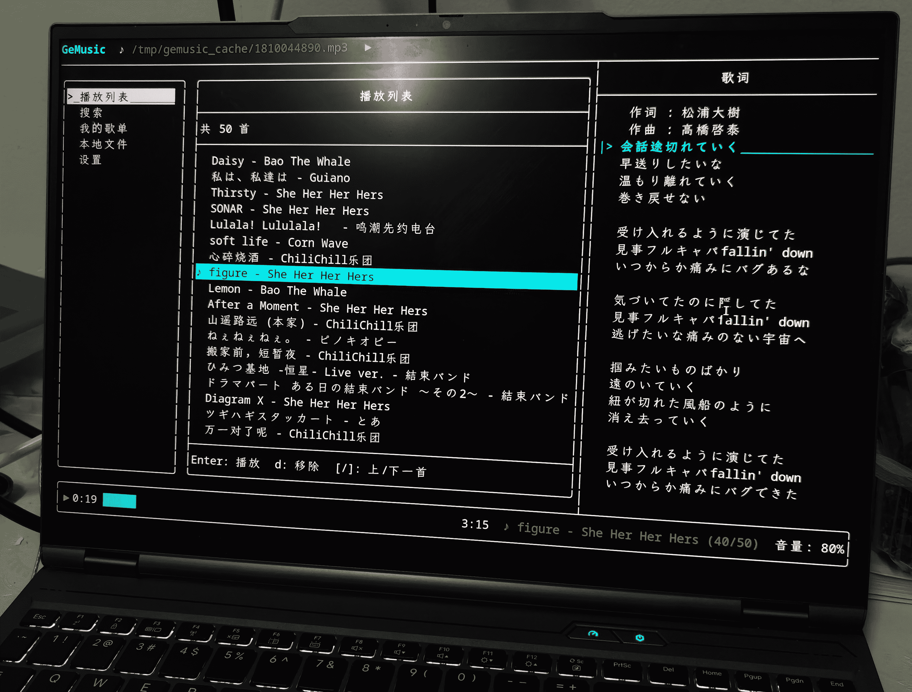
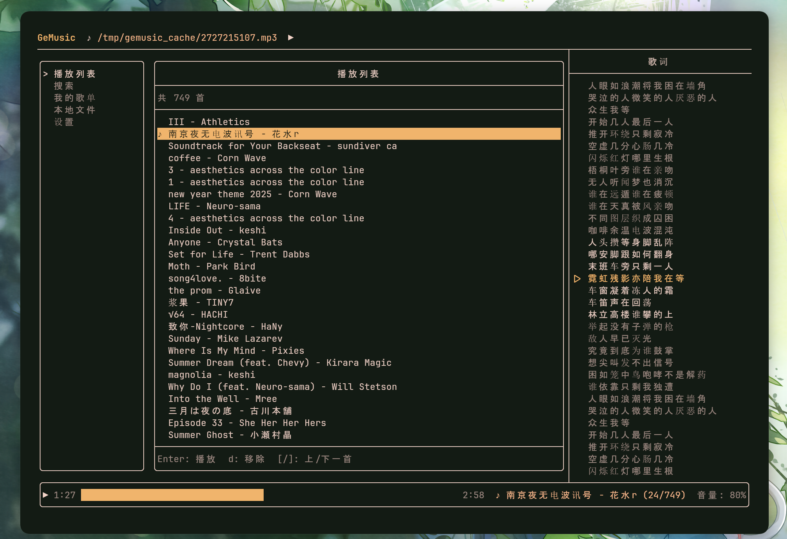
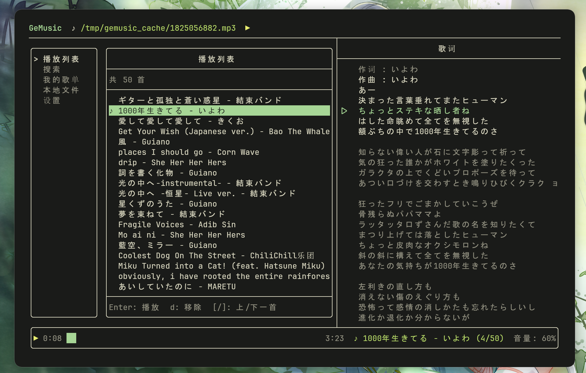
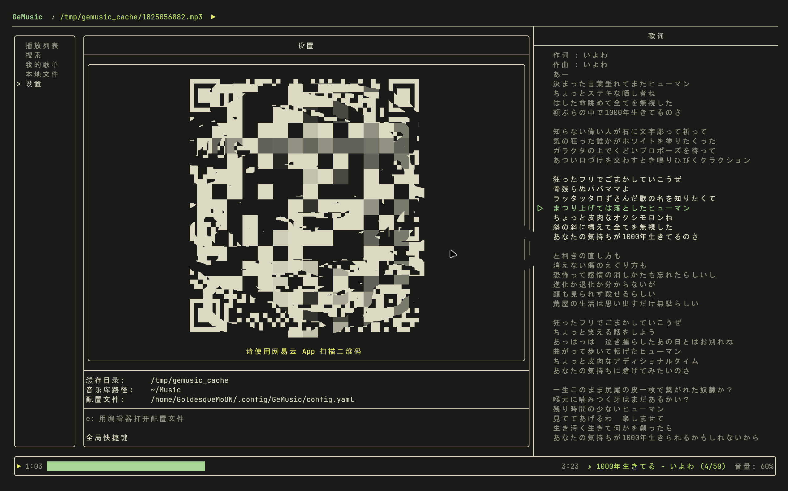

# GeMusic — 终端网易云音乐播放器

一个运行在终端里的网易云音乐播放器，基于 FTXUI 构建 TUI 界面，支持在线播放、歌单管理、本地音乐库和歌词显示。



---

## 为什么要做这个

网易云音乐的官方客户端体积臃肿、依赖繁重，Linux 版本更新迟缓，且完全不适合终端工作流。对于长期在终端里工作的用户来说，切换到 GUI 播放器听歌是一种打断。
GeMusic 的目标是：在不离开终端的前提下，完整使用网易云音乐的核心功能。

---

## 功能

- 扫码登录 / 账密登录 / Cookie 登录 (目前没有解决网易云风控问题，只能使用cookie登录)
- 获取并浏览我的歌单，播放任意曲目
- 在线搜索：搜索，支持分页自动加载
- 播放队列管理（替换、追加、移除）
- 本地音乐库扫描与播放（支持 mp3、flac、wav、ogg 等格式）
- 歌词面板，支持拖拽调整宽度，自动滚动高亮当前行
- 进度条拖拽，音量调节
- 音频缓存，已播放过的歌曲再次播放无需重新下载
- 配置文件持久化保存至 `~/.config/GeMusic/config.yaml`

---

## 安装

### AUR（Arch Linux）

> *AUR 包正在准备中，敬请期待。*

### 手动编译

**安装依赖（Arch Linux）**

```bash
sudo pacman -S cmake gcc openssl curl
```

其余依赖（FTXUI、nlohmann/json、yaml-cpp、spdlog 等）由 CMake 在构建时自动下载。

**步骤**

```bash
git clone https://github.com/Goldppx/GeMusic.git
cd GeMusic
cmake -B build -DCMAKE_BUILD_TYPE=Release
cmake --build build --target GeMusic -j$(nproc)
sudo install -Dm755 build/GeMusic /usr/local/bin/GeMusic
```

---

## 快捷键

| 按键 | 功能 |
|---|---|
| `Space` | 播放 / 暂停 |
| `[` / `]` | 上一首 / 下一首 |
| `,` / `.` | 后退 / 前进 10 秒 |
| `=` / `-` | 音量 +5 / -5 |
| `l` | 显示 / 隐藏歌词面板 |
| `Enter` | 播放选中 / 打开歌单 / 提交搜索 |
| `a` | 追加到播放队列 |
| `r` | 刷新当前页面 |
| `Esc` | 搜索页：结果列表 → 返回输入框 |
| `q` | 退出 |

---

## 贡献

欢迎提交 Issue 和 Pull Request。

- 代码风格遵循 Google C++ Style Guide，注释使用中文
- 提交信息遵循 Conventional Commits 规范
- 构建与测试：

```bash
cmake -B build -DCMAKE_BUILD_TYPE=Debug
cmake --build build
cd build && ctest --output-on-failure
```

---

## 致谢

- [go-musicfox](https://github.com/anhoder/go-musicfox) — 同样优秀的终端网易云播放器，提供了很多思路上的参考
- [NeteaseCloudMusicApi](https://github.com/Binaryify/NeteaseCloudMusicApi) — 提供了完整的网易云 API 逆向文档，是本项目网络层的基础

---

## 许可证

[Apache License 2.0](LICENSE)

## 第三方依赖许可声明

本项目遵循 Apache‑2.0 许可。项目中使用和/或捆绑了若干第三方开源库，以下为主要依赖及其许可证：

- FTXUI — MIT (licenses/FTXUI.MIT.txt)
- nlohmann/json — MIT (licenses/nlohmann_json.MIT.txt)
- yaml-cpp — MIT (licenses/yaml-cpp.MIT.txt)
- spdlog — MIT (licenses/spdlog.MIT.txt) （依赖 fmt，fmt 为 MIT）
- miniaudio — Public Domain or MIT-0 (licenses/miniaudio.LICENSE.txt)
- qrcodegen (Project Nayuki) — MIT (见源码头注释，licenses/qrcodegen.MAYBE.txt)
- GoogleTest — BSD (licenses/googletest.BSD.txt)
- OpenSSL — Apache 2.0 (licenses/OpenSSL.LICENSE.txt)
- libcurl (curl) — curl license (licenses/curl.COPYING.txt)

完整的第三方许可证文本见仓库目录 `licenses/`。在分发二进制或打包时，请一并包含 `licenses/` 目录以满足各开源许可证的要求。

如需对某个依赖的许可证有疑问，请指出具体库名，我会补充更详细的来源与说明。

## 更多图片展示





